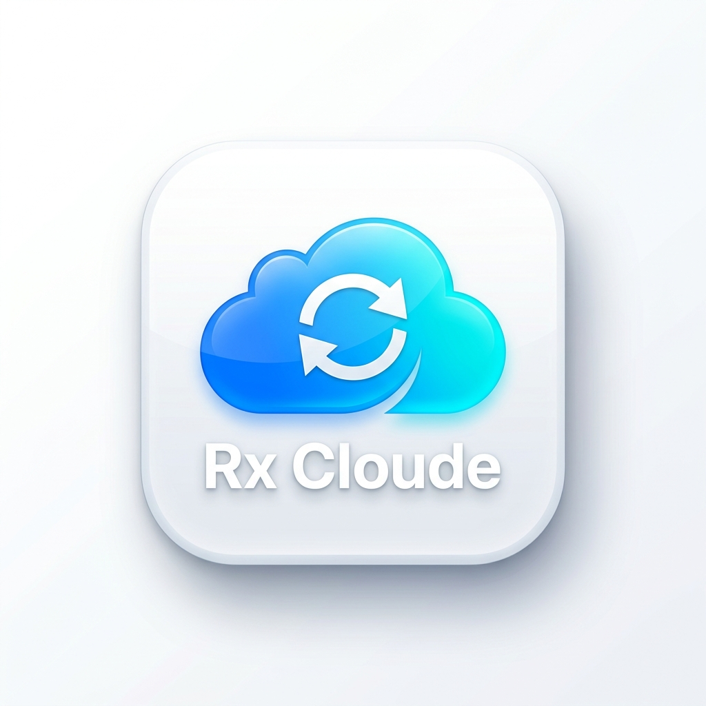
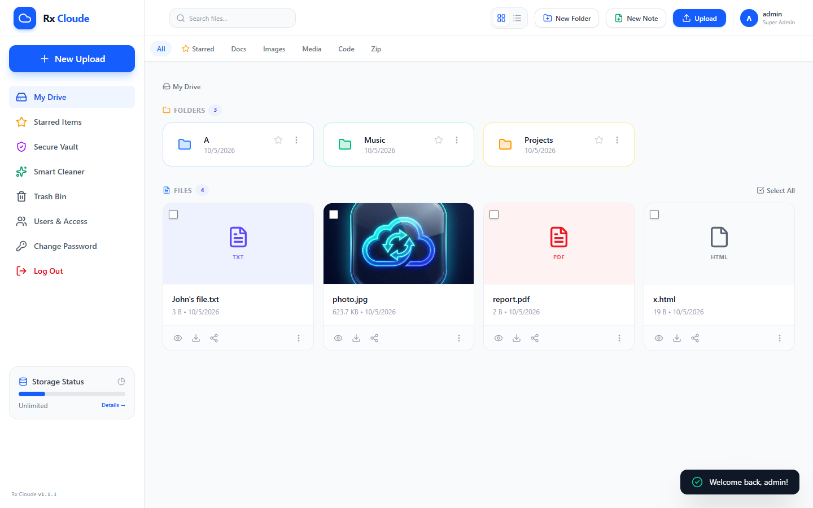
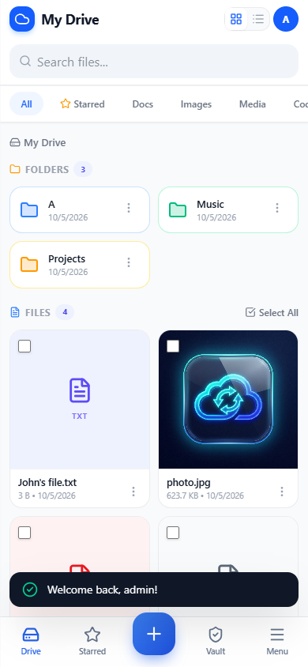
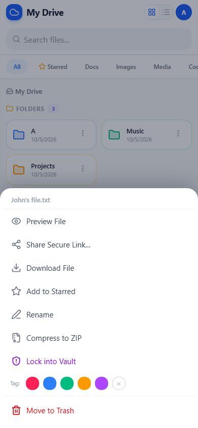
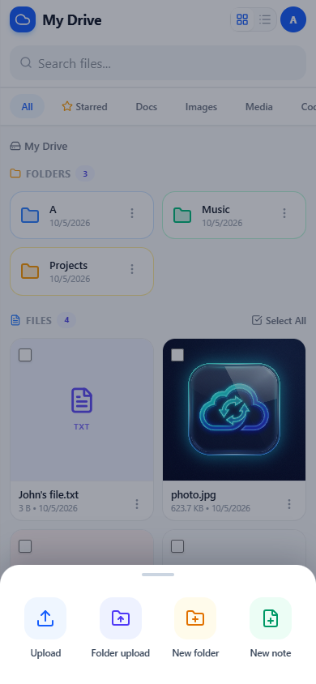
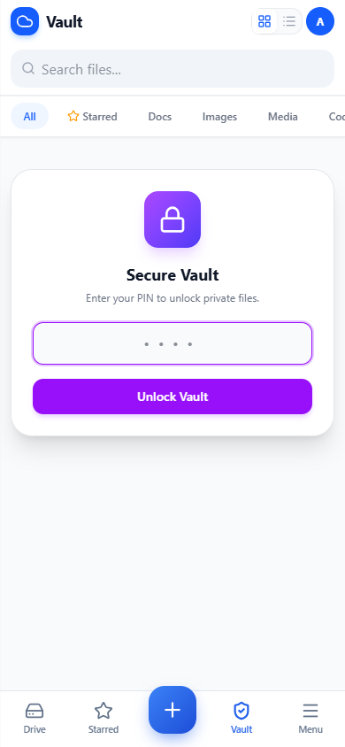

<div align="center">



# Rx Cloude

**A portable, zero-install cloud drive for Windows.**
Copy one `.exe` to any PC or server, pick a port and a folder, and everyone on your network gets a private web drive. It works on desktop and phone, and phones can install it as an app.

[](https://github.com/itrabbi24/rx_cloud_ftp/actions/workflows/ci.yml)


</div>

<p align="center">
  
  &nbsp;
  
</p>

---

## Features

- **One file, no install.** `RxCloude.exe` embeds the Node.js server and the web UI. You don't need Node, a database or IIS.
- **Users and permissions.** Admins create accounts with per-user folders, quotas and permissions for upload, download, rename, delete and share. Self-registration is optional.
- **Share links.** Public links can have an expiry, a password and a download limit.
- **Encrypted vault.** Files are encrypted with AES-256-GCM using a per-user PIN. The vault asks for the PIN every time it is opened and locks again when you leave it.
- **Built for phones.** The phone layout has a bottom tab bar, bottom-sheet menus and 2-column tiles, and you can install it as an app.
- **File tools.** Previews (images, video with seeking, PDF), a built-in note and code editor, ZIP compress and extract, folder upload that keeps its structure, trash with restore, a duplicate and large-file cleaner, stars and colour tags.
- **Easy server setup.** The launcher remembers its settings, can start with Windows straight to the tray, shows first-run credentials, and has a one-click Windows Firewall rule.

<p align="center">
  
  
  
</p>

## Quick start (users)

1. Download `RxCloude.exe` from the [latest release](https://github.com/itrabbi24/rx_cloud_ftp/releases/latest).
2. Put it in any folder, for example `D:\RxCloude\`, and run it.
3. Choose a **port** (such as `8090`) and a **shared folder**, then click **Start Server**.
4. On first run a dialog shows the admin login. It is also saved in `data\FIRST-LOGIN.txt`. Sign in at `http://localhost:8090` and choose your own password.
5. To let other devices connect, click **Allow other devices (Windows Firewall)**, then open `http://<server-ip>:8090` on them.

> **Choosing a port:** use a port above 1024 that no other program is using, such as `8090`, `8888` or `9000`. Browsers refuse some ports (for example `123`, `6000`, `10080`), and the launcher will reject those.

### Headless / command line

```bat
RxCloude.exe --port 8090 --dir "D:\Shared Files"
RxCloude.exe --port 8443 --dir "D:\Shared" --https
```

| Option | Description |
|---|---|
| `--port`, `-p` | TCP port to listen on |
| `--dir`, `-d` | Folder to share |
| `--root`, `-r` | Where `data\` is stored (default: next to the exe) |
| `--https` | Serve HTTPS with a self-signed certificate |

| Environment variable | Description |
|---|---|
| `RX_CLOUDE_ADMIN_PASSWORD` | Initial admin password for a fresh install, used instead of a random one |
| `RX_CLOUDE_ROOT`, `RX_CLOUDE_DIR`, `RX_CLOUDE_PORT`, `RX_CLOUDE_SCHEME` | Same as the options above |

### Where data lives

Everything is stored in `data\` next to the exe: `config.json`, `users.json`, `shares.json`, `vault.json` and the extracted web UI. Back up that folder together with your shared folder. To reset all accounts, stop the server and delete `data\users.json`.

## Development

**Requirements:** Windows 10/11, Node.js 18 or newer, and the .NET Framework 4.x (included with Windows) for the launcher.

```bash
git clone https://github.com/itrabbi24/rx_cloud_ftp.git
cd rx_cloud_ftp
npm install
npm run dev          # server from source on http://localhost:8090
npm run check        # syntax + sanity checks (same as CI)
npm run build        # dist/RxCloudeEngine.exe, dist/RxCloudeServer.exe, dist/RxCloude.exe
```

### Project layout

```
src/            Node.js server
  server.js       Express app, REST API, WebSocket log, HTTPS
  db.js           JSON storage (config, users, shares, vault) in data/
  permissions.js  permission checks
  server_cli.js   engine entry point (RxCloudeEngine.exe)
  launcher.js     interactive console entry point (RxCloudeServer.exe)
public/         Web UI (Tailwind + Lucide, no build step)
  index.html, app.js, features.js   drive, vault, sharing, admin
  mobile.css, mobile.js             phone app shell
  share.html                        public share page
launcher/       Windows launcher (C# WinForms) -> RxCloude.exe
scripts/        build tooling (asset bundle, GUI compile, version stamp, checks)
assets/         icons
docs/           screenshots and release history
```

### How the single exe works

1. `scripts/build-assets.js` packs `public/` into `src/assets-bundle.js` (base64). `pkg` cannot embed it as plain assets.
2. `pkg` compiles `src/server_cli.js` into `dist/RxCloudeEngine.exe`.
3. `scripts/build-gui.js` compiles the launcher and embeds the engine as a resource, producing `dist/RxCloude.exe`.
4. At runtime the launcher extracts the engine to `%LOCALAPPDATA%\RxCloude`, and the engine extracts the UI to `data\web`. The UI is refreshed whenever its content hash changes.

## Contributing

Contributions are welcome. Please read [CONTRIBUTING.md](CONTRIBUTING.md) and our [Code of Conduct](CODE_OF_CONDUCT.md). To report a vulnerability, follow [SECURITY.md](SECURITY.md) and don't open a public issue.

## License

[ISC](LICENSE) © ARG RABBI
